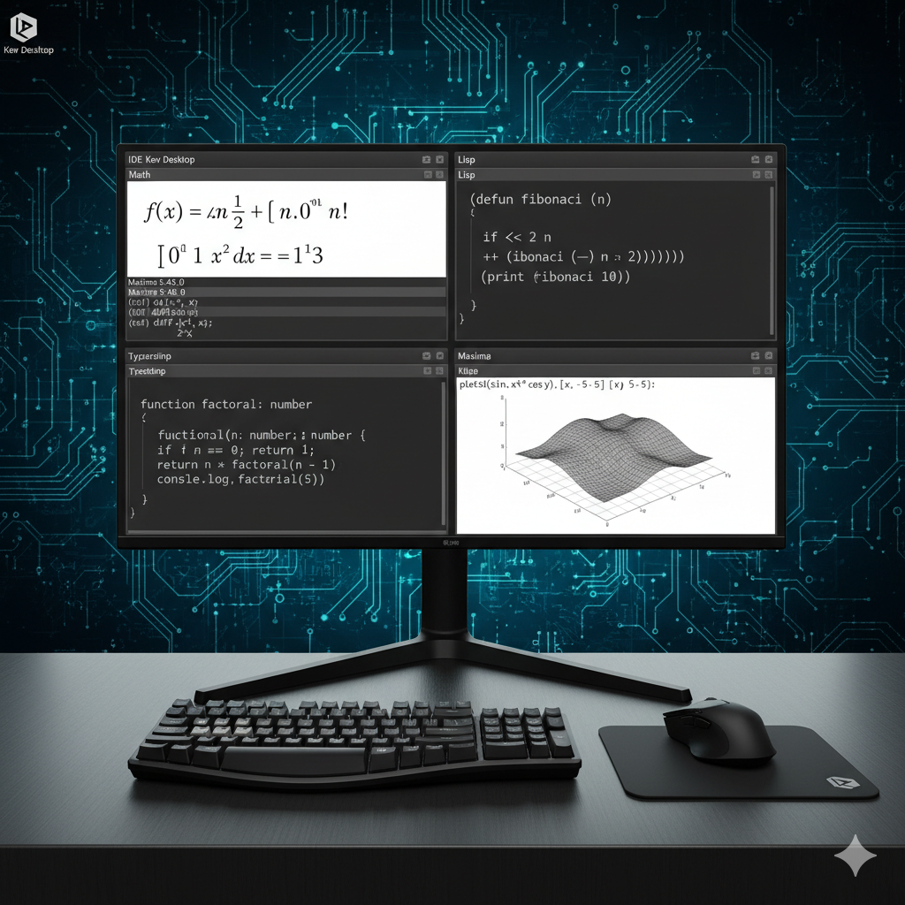

Here is a sample README.md file for your project "./kevudcva" which is an IDE named Kev Desktop focused on developing Math, Maxima, TypeScript, and Lisp projects:



```markdown
# Kev Desktop (./kevudcva)

Kev Desktop is an Integrated Development Environment (IDE) designed to enhance productivity for developers working with mathematical software and languages including Maxima, TypeScript, and Lisp. This project integrates tools and workflows to facilitate efficient development and debugging of advanced mathematical code.

## Features

- Development support for Maxima (computer algebra system)
- TypeScript integration for robust JavaScript-based tooling
- Lisp language support with enhanced editing and evaluation
- Mathematical modeling and symbolic computation tools
- Multi-language project management within a unified environment

## Installation

Instructions to build and install Kev Desktop will be provided here (e.g., dependencies, build commands, platform specifics).

## Usage

Step-by-step guide to start using the IDE, including opening projects, running scripts, and accessing language-specific features.

## Project Structure

- `/src` - Source code for the IDE
- `/docs` - Project documentation and guides
- `/examples` - Sample projects using Maxima, TypeScript, and Lisp
- `/tests` - Automated tests and validation scripts

## Contributing

Contributions to Kev Desktop are welcome. Please follow the project's coding guidelines and submit pull requests for review.

## License

Specify your preferred license here, e.g., MIT, GPL, or custom.

## Contact

Project maintainers and contributors can be contacted via [contact info or repository issues].

---

This README should be updated regularly to reflect new features and changes in the IDE.

```

This template can be customized further as you develop and add documentation. Let me know if you want the actual file content generated for direct use.

[1](https://www.drupal.org/docs/develop/managing-a-drupalorg-theme-module-or-distribution-project/documenting-your-project/readmemd-template)
[2](https://dev.to/zand/a-comprehensive-and-user-friendly-project-readmemd-template-2ei8)
[3](https://www.freecodecamp.org/news/how-to-structure-your-readme-file/)
[4](https://mhucka.github.io/readmine/)
[5](https://github.com/mhucka/readmine)
[6](https://www.thegooddocsproject.dev/template/readme)
[7](https://github.com/othneildrew/Best-README-Template)
[8](https://www.reddit.com/r/programming/comments/cfeu99/readme_template_i_use_for_most_of_my_projects/)
[9](https://www.makeareadme.com)
[10](https://www.reddit.com/r/opensource/comments/txl9zq/next_level_readme/)